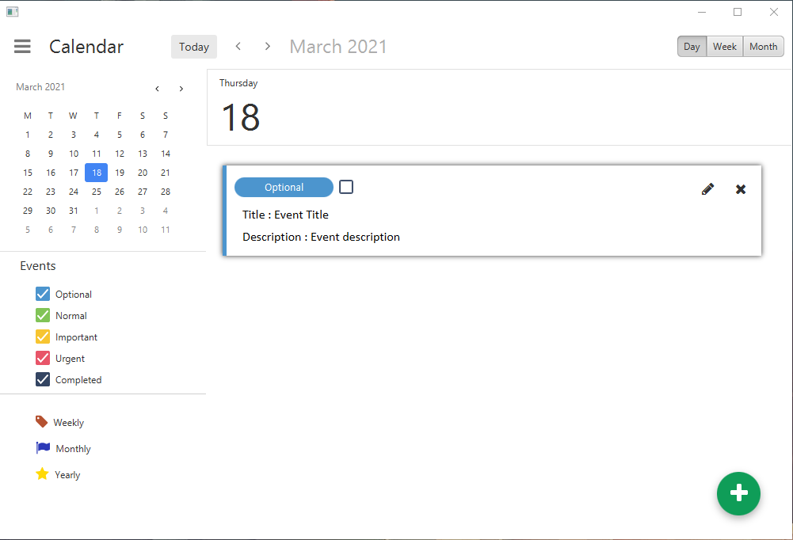
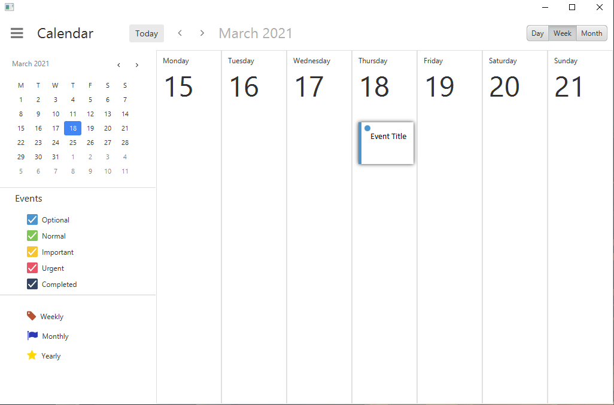
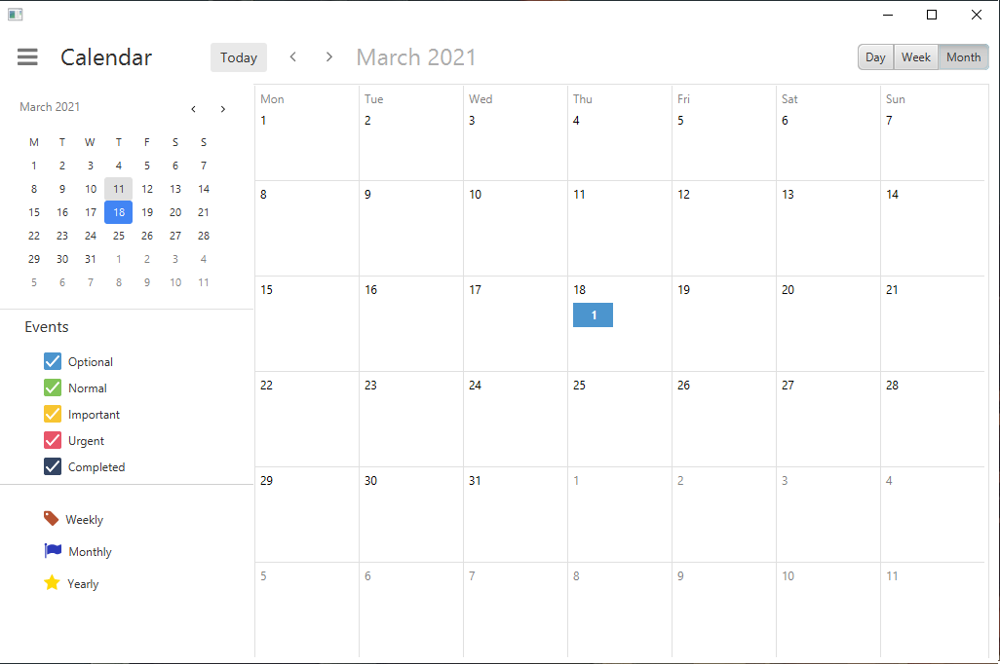

# JFXCalendar

This library contains a simple calendar view and an event manager in order to store and display events. The feel and look of the user interface was inspired from Google Calendar. It is really easy to use and can be integrated to any JavaFX application. 

DayView   |  WeekView | MonthView
:-------------------------:|:-------------------------:|:-------------------------:
  |   | 


#### How to use it?
1. Create the event manager which contains and handles the events 
2. Create the JFXCalendarView and add it to your Pane

```java
// Event manager which contains all the events 
CalendarEventManager eventManager = new CalendarEventManager();

// Calendar view
JFXCalendar calendar = new JFXCalendar(eventManager);
```

#### How to add an event

There are two type of events <b>ONE_TIME_EVENT</b> and <b>RECURRING_EVENT</b>. Each event has a priority {OPTIONAL, STANDARD, IMPORTANT, URGENT| each has a different color.


```java
// EXAMPLES 
// ===========================
event = new CalendarEvent(title, eventType, description);
event.setType(CalendarEvent.ONE_TIME_EVENT);
event.setDate(LocalDate.now());

// per week
event = new CalendarEvent(title, eventType, description);
event.setType(CalendarEvent.RECURRING_EVENT);
event.setPeriodicType(CalendarEvent.PER_WEEK);
event.setDaysInWeek("1,3,5,7"); // monday, Wednesday , Friday , Sunday

// per month
event = new CalendarEvent(title, eventType, description);
event.setType(CalendarEvent.RECURRING_EVENT);
event.setPeriodicType(CalendarEvent.PER_MONTH);
event.setPlaceInMonth(CalendarEvent.START_OF_MONTH);
// or event.setPlaceInMonth(CalendarEvent.END_OF_MONTH);

// per year
event = new CalendarEvent(title, eventType, description);
event.setType(CalendarEvent.RECURRING_EVENT);
event.setPeriodicType(CalendarEvent.PER_YEAR);
event.setYearlyDate(LocalDate.now());

// refresh the calendar
calendar.refreshCalendar();
```
